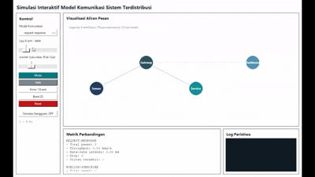
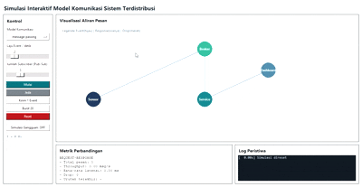

# Simulasi Interaktif Model Komunikasi dalam Sistem Terdistribusi

Dokumen ini adalah satu-satunya dokumentasi utama untuk pengumpulan.

Dokumen tambahan penjelasan kode proyek:

1. [PENJELASAN_KODE.md](PENJELASAN_KODE.md)

## Ringkasan

Simulasi ini mengimplementasikan 3 model komunikasi:

1. Request-Response
2. Publish-Subscribe
3. Message Passing

Semua model dibandingkan menggunakan metrik real-time: total pesan, throughput, rata-rata latensi, drop, dan urutan event.

## Struktur Kode

1. `simulator.py` -> UI Tkinter, loop simulasi, render visual, metrik, analisis perbandingan
2. `models/common.py` -> data class `Node` dan `Packet`
3. `models/request_response_model.py` -> logika Request-Response
4. `models/publish_subscribe_model.py` -> logika Publish-Subscribe
5. `models/message_passing_model.py` -> logika Message Passing

## Jalankan Aplikasi

```bash
python simulator.py
```

## Kontrol Simulasi

1. Model Komunikasi: `request-response`, `publish-subscribe`, `message-passing`
2. Laju Event/detik
3. Jumlah Subscriber (khusus Publish-Subscribe)
4. Mulai, Jeda, Kirim 1 Event, Burst 20, Reset
5. Simulasi Gangguan ON/OFF

## Media Demo

File media disimpan di folder [docs/assets](docs/assets):

1. [docs/assets/requestresponse.gif](docs/assets/requestresponse.gif)
2. [docs/assets/publishsubscribe.gif](docs/assets/publishsubscribe.gif)
3. [docs/assets/messagepassing.gif](docs/assets/messagepassing.gif)

## Cara Buka Media

1. Di lokal (VS Code Explorer): klik file `.mp4` atau `.gif` di folder `docs/assets`.
2. Di GitHub:
	- File GIF akan tampil animasi langsung jika dipanggil dengan sintaks gambar markdown.
	- File MP4 dibuka dengan klik link file video.

Contoh embed GIF (akan bergerak di GitHub):

```md

```

## Preview GIF


Penjelasan:
Pada cuplikan ini alur komunikasinya satu lawan satu. Sensor mengirim request ke service, lalu service mengirimkan response kembali. Polanya berurutan dan jelas titik awal-akhirnya. Bagian ini saya gunakan untuk menunjukkan bahwa Request-Response cocok ketika pengirim memang menunggu jawaban langsung.


Penjelasan:
Di sini terlihat satu event dari publisher bisa diteruskan ke beberapa subscriber sekaligus. Saya menekankan bahwa pengirim tidak perlu tahu siapa penerimanya satu per satu. Model ini lebih pas untuk distribusi data ke banyak komponen, misalnya notifikasi atau telemetry yang dipantau banyak layanan.



Penjelasan:
Cuplikan ini menunjukkan pesan bergerak bertahap antarkomponen, dari pengirim ke perantara, lalu ke pemroses. Karakter utamanya ada di alur pipeline: pesan tidak langsung selesai di satu titik, tetapi diteruskan sesuai tahapan. Ini relevan untuk proses antrian kerja atau pemrosesan data berantai.
